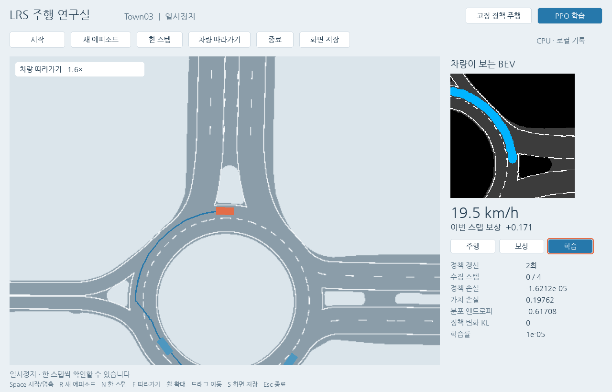

# LRS: Low Resource Simulation — LRS_V1

[한국어 실행 안내](README_ko.md)

Offline BEV driving simulation with a Korean Pygame interface, fixed Roach policy inference, and a separate ego PPO trainer. Tracking imports, authentication, and uploads have been removed from the active workflow; metrics and outputs are stored locally.

**Status: short execution and correctness checks passed in the recorded local environment. The short learned policy did not improve on the original policy. Long training and full-route safety remain unvalidated.**



This is a recorded local validation run. Git preparation did not restart the GUI or run training.

## Prepare before running

Read [ASSET_SETUP.md](ASSET_SETUP.md). A fresh clone does not contain the required policy checkpoint, extracted maps, a virtual environment, or private GUI settings. The checkpoint's public download source is unresolved. **The GUI, simulator, and PPO trainer require the original NPC checkpoint even with `--from-scratch` for the ego agent.**

The existing tracked map ZIP in `sim_using_data/` is preserved unchanged. Its contents were not downloaded or inspected during preparation. Extract it locally and verify the required layout before use.

Create the ignored local GUI settings and set an installed Korean font path:

```bash
cp gui_settings.example.json gui_settings.json
```

`requirements.txt` lists direct core imports. Essential compatibility versions are described in the setup guide; OpenCV 4.13 requires NumPy >=2 while the working environment had NumPy 1.26.4, so its dependency metadata is inconsistent. The list is not a verified install specification or lockfile. Clean dependency resolution and fresh execution remain untested. A compatible existing Python environment can be reused through `.venv --system-site-packages`; see the asset guide for project-relative setup commands. `run.sh` requires `.venv/bin/python`.

## Run from the repository root

Use these commands after preparing assets and the environment. The bounded CPU/CUDA examples match the scope of earlier checks; they were not rerun during Git preparation.

```bash
# Opens paused; press Start to run the selected mode
./run.sh

# Fixed policy, without learning
./run.sh simulate.py --headless --steps 60 --device cpu

# Ego PPO and independent-seed evaluation
./run.sh ppo_train.py --steps 64 --rollout 32 --epochs 2 --batch-size 16 \
  --episode-steps 128 --eval-steps 32 --device cpu

# Bounded CUDA execution check
./run.sh ppo_train.py --steps 4 --rollout 4 --epochs 1 --batch-size 4 \
  --episode-steps 8 --skip-eval --device cuda
```

The default `train_w.py` command also opens the new GUI. Its retained `train()` and `experimental_main()` are historical code; use `ppo_train.py` for the validated trainer. There is no automatic five-million-step training run.

Space starts/pauses, N advances one paused step, R resets the episode, F follows the vehicle, S saves the window, and Esc closes it. Select fixed-policy simulation or PPO before starting. Pausing stops physics, collection, and updates. Mode changes do not start execution automatically. See [UI_GUIDE.md](UI_GUIDE.md) for controls and recorded screenshots.

Outputs default to a new `roach_run/<Town>/<timestamp>/` directory. GUI runs record JSONL metrics and summaries, and save `ppo_latest.pth` after updates. Headless simulation records the actual BEV video. CLI PPO saves final weights and evaluation records. Generated models, videos, and run directories are excluded from Git.

## Implementation and contracts

| Path | Role |
| --- | --- |
| `gui.py`, `simulate.py` | Korean GUI and fixed-policy simulation |
| `ppo_train.py`, `roach/ppo.py` | Ego PPO collection, updates, checkpoint output, evaluation |
| `task_reward.py`, `reward_config.json` | Task reward and terminated/truncated contract |
| `loop.py`, `sim/` | Offline dynamics, routes, pedestrians, traffic lights, BEV |
| `roach/models/`, `roach/utils/checkpoint.py` | Original policy and restricted checkpoint loading |
| `validation/tests/`, `validation/no_tracker/` | Reproduction tests and tracker-import blocking |
| `env.py`, `model/ppo.py`, `data_gan.py` | Earlier variants; full execution not revalidated |

`birdview` is float32 with shape `(15, 192, 192)` and range 0–255; the policy normalizes it by 255. `state` has six control/ego-frame velocity values. Acceleration/braking and steering form two actions in `[-1, 1]`. Default entrypoints advance simulation at 1/30 second per step.

Active NPCs share a fixed Roach policy and run deterministic batched inference on individual observations. PPO updates the ego policy. Pedestrians use scripted behavior. BEV inputs come from maps and simulated actor states, rather than camera-derived perception.

Collection, old log probabilities, values, bootstrap, and updates use the same ego PPO policy. Beta actions account for the range-transform Jacobian. True terminal states disable value bootstrap; truncation uses the last observation, and GAE stops at episode boundaries. Task rewards account for newly reached route progress, time, route/heading error, control changes, and prioritized failure termination.

Legacy checkpoint loading uses `weights_only=True` and a scoped Gym/NumPy type allowlist only for its exact path and SHA256. There is no unrestricted-pickle retry. Some retained Roach criteria/wrappers require an external `carla_gym` package that is not bundled.

## Recorded validation and limits

Existing records cover 12 reward/action/termination contracts, original policy equivalence, pre-update ratios near one, finite metrics, 34 changed parameter tensors, exact save/reload equality, repeated GUI operation/recovery/resize/close/reopen, CPU 64 steps with two updates, and CUDA four steps with one update. Tracker imports were blocked.

Evaluation used independent seeds 101/102/103, each with at most 32 steps (about 1.07 seconds):

| Policy | Mean task return | Mean new route progress | Route completions |
| --- | ---: | ---: | ---: |
| 64-step learned | 3.463 | 5.615 m | 0/3 |
| Original fixed | 3.851 | 6.027 m | 0/3 |
| Uniform random | -5.144 | 3.658 m | 0/3 |

**The short learned policy did not improve on the original policy.** These checks establish bounded execution and contracts, not convergence, generalization, collision safety, full-route performance, or profitability. Long training, full-route evaluation, a real CARLA server, and vehicle control were not run. NPU integration, data-quality gains, and lower resource cost are unverified research goals.

[VALIDATION.md](VALIDATION.md) contains failures, corrections, evidence, and limitations. Raw logs, tracebacks, environment dumps, and model/video artifacts remain local. The public validation summary retains the measured results without personal paths or host details. Preparation checked syntax, source hashes, secret patterns, document links, and the protected Git tree identity.

The checkpoint's public provenance, a clean environment install, and full execution from a fresh checkout remain unresolved. The existing [LICENSE](LICENSE) is retained.
